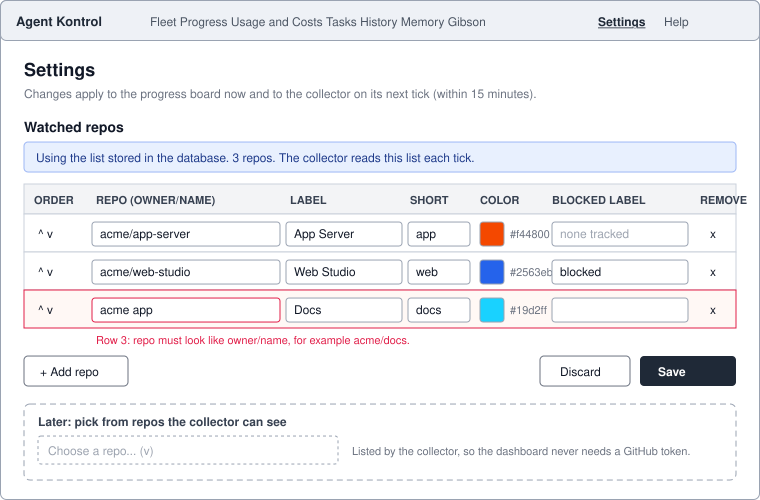

# Design: Settings, watched repos

Status: approved for the first version. The repo picker is designed here and built later.



## Problem

The repos on the progress board live in `progress.config.json`, optionally replaced by the build-time variable `NEXT_PUBLIC_MC_PROGRESS_CONFIG`. Adding one means editing Vercel, redeploying, and separately editing the config on each machine that runs the collector. Reinstalling the collector overwrites its copy. Two lists drift, and a redeploy is needed for a data change.

## Goals

- Add, edit, reorder and remove watched repos from the dashboard, with no redeploy.
- The collector picks changes up on its next tick without any edit on its machine.
- The dashboard keeps its rule of never calling GitHub, and stores no GitHub token.
- A fresh install and demo mode still work with no database and no setup.

## Non-goals (first version)

- A repo picker (second step, below).
- Per-user permissions. The existing trust model stands: anyone with a dashboard session or `MC_TOKEN` can change settings.
- Editing alert thresholds or lane-bot prefixes. They stay in `progress.config.json` for now. The page is built so more sections can be added.

## Decisions

| Question | Decision | Why |
| --- | --- | --- |
| Where is the list stored? | A `watched_repos` table. | Changes apply immediately and survive redeploys. |
| What if the table is empty? | Fall back to `progress.config.json` (or the build-time variable). | Fresh installs and demo mode work unchanged. |
| Which wins? | Rows in the database. | The page is the place people change it. |
| How does the collector learn the list? | It calls `GET /api/settings/repos` with its token each tick, and falls back to its local file if that fails. | No edits on the machine, and it still runs when the dashboard is unreachable. |
| How does the progress page get repos? | From the `/api/progress` response, which already carries label, short and color per repo. | Removes the build-time dependency in the browser. |
| What happens to a removed repo's history? | Snapshots stay in the database. The repo is just no longer shown or collected. Adding it back restores the history. | No data loss from a mis-click. |
| Limits | At least 1 and at most 25 repos, `owner/name` format, unique repo and short name (ignoring case), color `#rrggbb`. | The collector spends the GitHub search budget per repo each tick. An empty list would silently fall back to the file, so the last repo cannot be removed. |

## Data

```sql
create table if not exists watched_repos (
  repo text primary key,          -- owner/name
  label text not null,
  short text not null,
  color text not null default '#2563eb',
  blocked_label text,             -- null means blocked work is not tracked
  position integer not null default 0,
  created_at timestamptz default now(),
  updated_at timestamptz default now()
);
```

Additive and idempotent, so the usual schema step applies it. There is no unique index on `short`: validation enforces it, so rows can be reordered or have names swapped one upsert at a time.

## API

Both routes sit behind the existing gate: dashboard session cookie or `Authorization: Bearer <MC_TOKEN>`.

`GET /api/settings/repos`

```json
{ "source": "database", "writable": true, "max": 25, "version": "1ded4c88e21150a4",
  "repos": [{ "repo": "acme/app-server", "label": "App Server", "short": "app",
              "color": "#f44800", "blockedLabel": null }] }
```

`source` is `"file"` when the table is empty or there is no database. `writable` is false in demo mode.

`PUT /api/settings/repos` with `{ "repos": [...], "version": "..." }` replaces the whole list in order. `version` is a fingerprint returned by GET; when sent and the list has changed since, the save is refused with `409 { "code": "stale" }`. Returns the stored list, or `400 { "errors": [{ "index": 2, "field": "repo", "message": "..." }] }`. Returns `409` when there is no database. The replace is a single SQL statement (upserts and the delete of removed rows together), so a failure part-way leaves the old list intact.

## Screens

See the wireframe. One row per repo with inline fields. Reorder with the arrows, remove with the x. Invalid rows get an inline message and block Save. A banner says where the list comes from. The page warns before leaving with unsaved changes. Read-only with an explanation when the API reports `writable: false`.

## Collector

On each tick, before reading its local file, `scripts/collect-progress.sh` asks the dashboard for the list. If the answer is `source: "database"` with at least one repo, it uses that. Otherwise it uses the file, as today. It logs which one it used. A new repo still needs `--backfill` once to fill history.

## Second step: the picker

The collector already has GitHub access. Once a day it posts the repos it can see (name, privacy, last push, capped) to `POST /api/progress/inventory`. The settings page then offers them in a dropdown, with already-watched repos hidden. The dashboard stores no token and still never calls GitHub.

## Failure modes

- Dashboard down: the collector uses its local file.
- Bad PUT: nothing changes, and the page shows what to fix.
- Two tabs: the second save is refused as stale and the page offers a reload. Truly simultaneous API writers can still interleave; that is accepted for a one-operator tool.
- Removing every repo: not allowed. Validation asks for at least one, because an empty table would fall back to the file list.

## Tests

Validation unit tests (format, uniqueness, limits, color), a store test on real Postgres in CI (replace, order, fallback), and a static check that the collector prefers the dashboard list.
